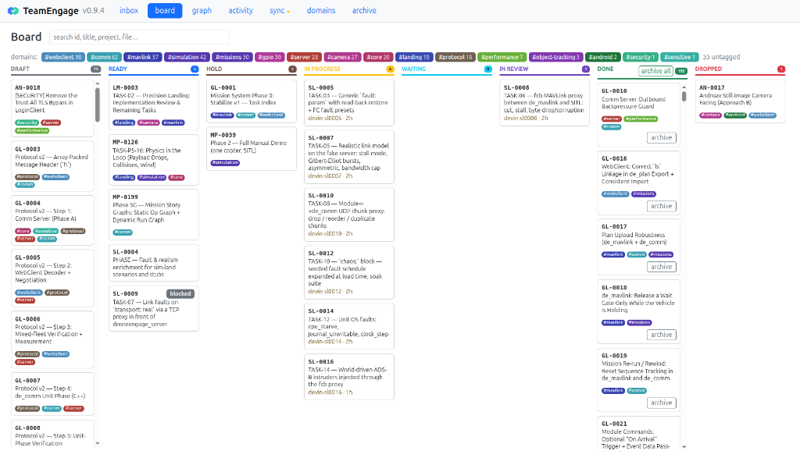
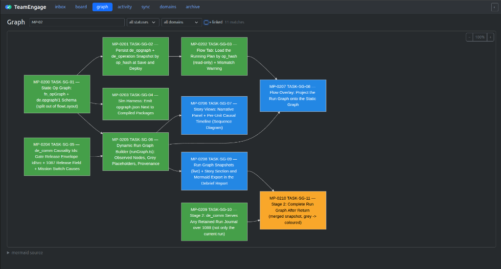
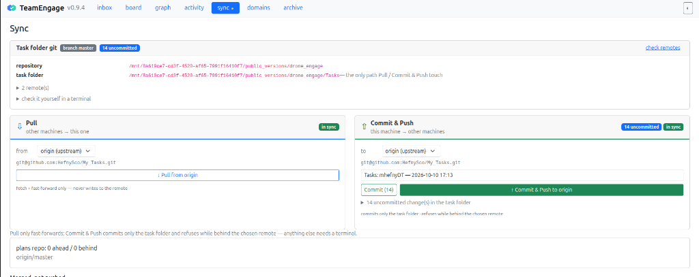

<p align="center"></p>

# TeamEngage

**A storyboard for one developer and their AI team.**

You plan the story; your AI agents — Claude Code, Devin, Gemini, Cursor,
on one machine or several — pick up the scenes, work them, and hand them back
for your review. TeamEngage is the board in between: everyone sees the same
plan, nobody takes the same task twice, nothing is "done" until you say so.

```
 you: plan · approve · answer · accept          agents: next → claim → log / ask → submit
            ╲                                                 ╱
             ╲──────────▶  TeamEngage board  ◀───────────────╱
                draft → ready → in progress → in review → done
```

| Board — every task, by status | Graph — dependencies as a diagram | Sync — git between machines |
|---|---|---|
|  |  |  |

### Why it helps

- **Your task files stay yours.** Point it at an existing folder of Markdown
  task specs; it tracks them in place (one `te:` line per file) and never
  copies or rewrites your content.
- **No two agents on the same work.** Agents *claim* a task before touching
  code; claims are visible across machines through git.
- **You stay in the loop, not in the way.** Agents *ask* instead of guessing
  (the question lands in your inbox) and *submit* with evidence; you accept,
  reject, hold, or mark key tasks that block until accepted.
- **Plans that read like a storyboard.** Board, dependency graph, domains
  (`#mavlink`, `#webclient`…) as hashtags, Markdown rendered, full History.
- **Rules agents actually follow.** Plain HTTP for any agent (`curl`, no MCP
  needed), skills for planning / executing / tagging, and an optional Claude
  Code guard that refuses edits that would break the tracking.
- **Several machines, one plan.** The task folder's own git repo is the sync
  channel; each machine runs one small local daemon.

### Quick start

```bash
git clone https://github.com/HefnySco/teamengage.git ~/teamengage
cd ~/teamengage && npm ci && npm run build && npm link

te init --overlay --root ~/my-project/Tasks --name tasks --prefix TK   # track an existing task folder
te import ~/my-project/Tasks --apply                                   # tag the task files (dry run without --apply)
te ui                                                                  # open the web board
curl http://127.0.0.1:4747/agent                                       # what your agents read
```

The task folder should be its own **git repository with a private remote** —
that is how the plan is shared with your other machines. Plan data never goes
into this (the tool's) repository.

**Setting it up on a machine, or asking an agent to?** Follow
[AGENTS.md](AGENTS.md) — step-by-step install, first/second machine, daemon
service, agent rules, skills, troubleshooting. Written for AI agents, readable
by humans.

More: [docs/DESIGN.md](docs/DESIGN.md) (concepts and state machine) ·
[docs/AGENTS-SETUP.md](docs/AGENTS-SETUP.md) (agent protocol) ·
[docs/TASK-FORMAT.md](docs/TASK-FORMAT.md) (task file format).

## Requirements

- Node.js >= 22
- git; rsync + ssh only for ssh/folder resources

## Develop

```sh
npm ci          # install
npm run build   # compile TypeScript to dist/ and bundle the web UI
npm test        # vitest
npm run lint    # eslint
npm run dev     # tsc --watch
```

## Layout

```
src/core        pure model: schema, parser, addressing, index, state machine,
                claims, validation, mermaid, event log
src/daemon      single-writer daemon: store, watcher, HTTP server, sessions,
                human API, SSE
src/mcp         MCP Streamable HTTP server, tools, stdio shim
src/cli         `te` commands
src/resources   git / ssh / folder / url resource drivers
src/sync        multi-machine plans-repo sync and reconciliation
src/import      importer for existing Markdown task folders
web/            human web UI, served by the daemon
skills/         agent skills: te-work (execute), te-plan (plan), te-tag (tag domains)
```

Task files in overlay workspaces follow `docs/TASK-FORMAT.md` (`te template`).

## License

MIT — free to use, modify and redistribute, including commercially; just keep
the copyright notice. See [LICENSE](LICENSE).
